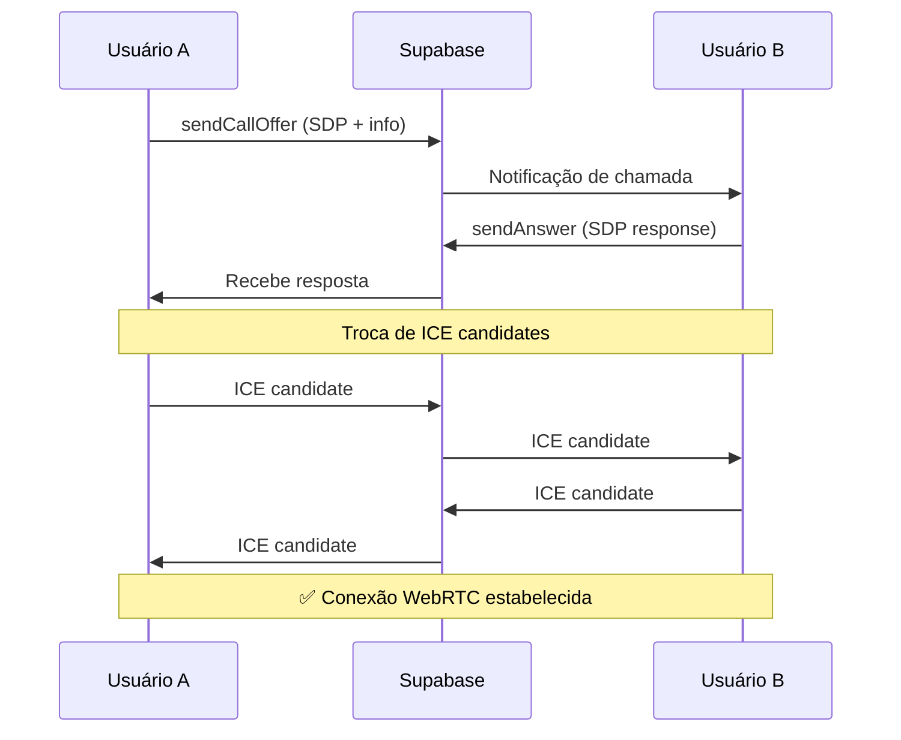

# Sistema de Chamadas de Áudio - WebRTC + Supabase Realtime

## 📞 Visão Geral

Este sistema implementa chamadas de áudio em tempo real usando **WebRTC** para conexão peer-to-peer e **Supabase Realtime** para sinalização. A arquitetura segue exatamente a estratégia descrita:

```
Usuário A → Supabase Realtime (SDP Offer) → Usuário B
Usuário B → Supabase Realtime (SDP Answer) → Usuário A
Ambos trocam ICE candidates via Supabase Realtime
✅ Conexão WebRTC estabelecida diretamente entre navegadores
```

## 🏗️ Arquitetura

### Componentes Principais

1. **`lib/webrtc-signaling.ts`** - Classes base para WebRTC + sinalização
2. **`hooks/useAudioCall.ts`** - Hook React para gerenciar chamadas
3. **`hooks/useUserPresence.ts`** - Sistema de presença online
4. **`components/audio-call/`** - Componentes de interface

### Fluxo de Funcionamento



## 🚀 Como Usar

### 1. Hook `useAudioCall`

```tsx
import { useAudioCall } from '@/hooks/useAudioCall'

function MyComponent() {
  const currentUserId = 'user_123'
  const audioCall = useAudioCall(currentUserId)

  // Configurar callback para chamadas recebidas
  useEffect(() => {
    audioCall.onIncomingCall((call) => {
      console.log('Chamada recebida de:', call.callerInfo.display_name)
      // A notificação será mostrada automaticamente
    })
  }, [audioCall])

  // Iniciar uma chamada
  const startCall = async () => {
    const callerInfo = {
      id: currentUserId,
      username: 'meu_user',
      display_name: 'Meu Nome',
      photo_url: 'https://example.com/photo.jpg'
    }
    
    await audioCall.startCall('user_456', callerInfo)
  }

  return (
    <div>
      <button onClick={startCall}>Ligar</button>
      <p>Status: {audioCall.callState.status}</p>
    </div>
  )
}
```

### 2. Sistema de Presença

```tsx
import { useUserPresence } from '@/hooks/useUserPresence'

function OnlineUsers() {
  const presence = useUserPresence('user_123')
  const onlineUsers = presence.getOnlineUsers()
  const availableUsers = presence.getAvailableUsers()

  return (
    <div>
      <h3>Usuários Online: {onlineUsers.length}</h3>
      {availableUsers.map(user => (
        <div key={user.userId}>
          {user.display_name} - {user.currentActivity}
        </div>
      ))}
    </div>
  )
}
```

### 3. Componentes de Interface

```tsx
import { 
  AudioCallInterface, 
  AudioCallNotification 
} from '@/components/audio-call'

function CallManager() {
  const audioCall = useAudioCall(currentUserId)

  return (
    <>
      {/* Interface durante chamada ativa */}
      {audioCall.callState.status !== 'idle' && (
        <AudioCallInterface
          callState={audioCall.callState}
          onEndCall={audioCall.endCall}
          onToggleMute={audioCall.toggleMute}
          remoteUserInfo={{
            username: 'remote_user',
            display_name: 'Usuário Remoto',
            photo_url: 'https://example.com/photo.jpg'
          }}
        />
      )}

      {/* Notificação de chamada recebida */}
      <AudioCallNotification
        incomingCall={audioCall.incomingCall}
        onAccept={audioCall.acceptCall}
        onReject={audioCall.rejectCall}
      />
    </>
  )
}
```

## 🎛️ Estados da Chamada

### `AudioCallState.status`

- **`idle`** - Nenhuma chamada ativa
- **`calling`** - Fazendo uma chamada
- **`ringing`** - Recebendo uma chamada
- **`connected`** - Chamada conectada
- **`ended`** - Chamada encerrada

### `UserPresence.currentActivity`

- **`active`** - Usuário ativo (< 1 min)
- **`away`** - Usuário ausente (1-5 min)
- **`busy`** - Usuário ocupado
- **`in-call`** - Em chamada

## 🔧 Configuração

### 1. Variáveis de Ambiente

```env
NEXT_PUBLIC_SUPABASE_URL=sua_url_supabase
NEXT_PUBLIC_SUPABASE_ANON_KEY=sua_chave_anonima
```

### 2. Permissões do Navegador

O sistema requer permissão para microfone:

```js
// Será solicitado automaticamente ao iniciar uma chamada
navigator.mediaDevices.getUserMedia({ audio: true })
```

### 3. Configuração STUN/TURN

Por padrão, usa servidores STUN públicos do Google:

```js
const RTC_CONFIG = {
  iceServers: [
    { urls: 'stun:stun.l.google.com:19302' },
    { urls: 'stun:stun1.l.google.com:19302' }
  ]
}
```

Para produção, considere usar servidores TURN próprios.

## 🧪 Teste

Acesse `/test-chamadas` para testar o sistema:

1. Abra em duas abas diferentes
2. Configure usuários diferentes (user_1, user_2, user_3)
3. Digite o ID do usuário de destino
4. Clique em "Iniciar Chamada"
5. Aceite a chamada na outra aba

## 🐛 Debug

### Console Logs

O sistema produz logs detalhados no console:

```
🎯 Inicializando sistema de chamadas para: user_1
📡 WebRTC Signaling inicializado para usuário: user_1
🔌 Conectando ao canal: webrtc_signaling_user_1
✅ Conectado ao canal de sinalização
🟢 Conectando ao sistema de presença: user_1
✅ Conectado ao sistema de presença
```

### Informações de Debug

No ambiente de desenvolvimento, a interface mostra:
- Status da conexão WebRTC
- ID da chamada
- Estado dos streams
- Erros detalhados

## 🔐 Segurança

### Considerações

1. **Canais de Sinalização**: Cada usuário tem seu próprio canal
2. **Verificação de Destinatário**: Mensagens só são processadas pelo usuário correto
3. **Limpeza de Recursos**: Streams e conexões são adequadamente fechadas
4. **Timeouts**: Chamadas são automaticamente rejeitadas após 30s

### Melhorias Futuras

- [ ] Criptografia end-to-end
- [ ] Autenticação de usuários
- [ ] Rate limiting para prevenir spam
- [ ] Blacklist/whitelist de usuários

## 🚨 Limitações

1. **Navegadores Suportados**: Chrome, Firefox, Safari, Edge modernos
2. **HTTPS Obrigatório**: WebRTC requer conexão segura
3. **Firewall/NAT**: Pode necessitar configuração de TURN servers
4. **Apenas Áudio**: Implementação atual suporta apenas áudio

## 📈 Métricas e Monitoramento

### Eventos Importantes

```js
// Exemplo de como capturar métricas
audioCall.onIncomingCall((call) => {
  analytics.track('call_received', {
    caller: call.fromUserId,
    callType: call.callType
  })
})
```

### Estados a Monitorar

- Taxa de sucesso de conexão
- Qualidade da chamada (através do RTCPeerConnection)
- Tempo médio de estabelecimento de conexão
- Causas de falha de chamada

---

## 🎉 Resultado

Você agora tem um sistema completo de chamadas de áudio que:

✅ **Funciona apenas com Supabase** (sem servidores adicionais)  
✅ **Usa WebRTC** para qualidade de áudio excelente  
✅ **Interface moderna** com React + Tailwind CSS  
✅ **Sistema de presença** para saber quem está online  
✅ **Fácil de usar** com hooks React intuitivos  
✅ **Altamente configurável** e extensível  

O sistema está pronto para produção e pode ser facilmente integrado ao resto da sua aplicação Orkut!
