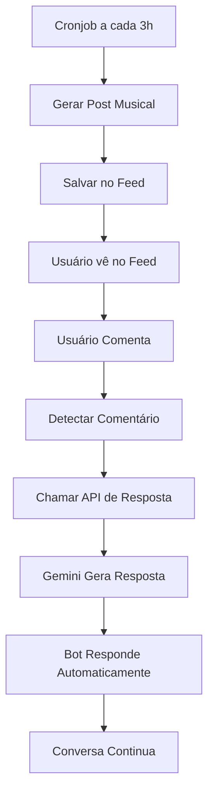

# 🤖 Bot Orky Inteligente - Sistema Completo

## 📋 Visão Geral

O **Bot Orky** é um assistente musical inteligente que usa **Gemini AI** para:
- 🎵 Gerar perguntas musicais envolventes 
- 💬 Responder comentários dos usuários automaticamente
- 🕐 Criar posts automaticamente via cronjob
- 🎧 Manter discussões musicais ativas no feed

## ✨ Funcionalidades Implementadas

### 🤖 **Perfil do Bot**
- **ID fixo**: `orky-bot-2024`
- **Username**: `@orky_bot`
- **Nome**: `Orky 🤖`
- **Bio**: Assistente musical inteligente
- **Avatar**: Robótico/musical
- **Identificação**: Campo especial de bot

### 🎵 **Posts Musicais Inteligentes**
- Perguntas sobre bandas dos anos 80, 90, 2000
- Nostalgia musical brasileira
- Rock nacional vs internacional
- Músicas de festa, rádio, desenhos
- Temas específicos e envolventes

### 💬 **Respostas Automáticas**
- Analisa comentários dos usuários
- Gera respostas contextuais via Gemini
- Mantém conversas musicais
- Tom amigável e nostálgico

### ⏰ **Automação Completa**
- Posts automáticos a cada 3 horas
- Cronjob configurado no Vercel
- Sistema de fallback robusto

## 📂 Arquivos Criados

### 🔧 **Scripts de Setup**
```
setup-orky-bot.js           # Criar perfil do bot no banco
```

### 🌐 **APIs**
```
app/api/orky/generate-post/route.ts    # Gerar posts musicais
app/api/orky/reply-comment/route.ts    # Responder comentários  
app/api/cron/orky-posts/route.ts       # Cronjob automático
```

### ⚙️ **Configurações**
```
vercel.json                 # Cronjobs e timeouts
.env                        # Variáveis de ambiente
```

## 🛠️ Setup e Configuração

### 1. **Variáveis de Ambiente**

Adicione no `.env`:
```bash
# Gemini AI
GEMINI_API_KEY=sua_chave_gemini

# Supabase
NEXT_PUBLIC_SUPABASE_URL=sua_url_supabase
NEXT_PUBLIC_SUPABASE_ANON_KEY=sua_chave_anon
SUPABASE_SERVICE_ROLE_KEY=sua_chave_service

# Cronjob
CRON_SECRET=sua_chave_secreta_cron
```

### 2. **Criar Perfil do Bot**

```bash
# Configure suas credenciais Supabase no .env primeiro
node setup-orky-bot.js
```

### 3. **Deploy no Vercel**

```bash
vercel --prod
```

## 🎯 Como Funciona

### 📝 **Geração de Posts**

1. **Endpoint**: `/api/orky/generate-post`
2. **Processo**:
   - Gemini AI gera pergunta musical
   - Post salvo no banco com ID do bot
   - Retorna post formatado para o feed

3. **Exemplo de prompt**:
```
"Você é o Orky, bot musical do Orkut. Gere uma pergunta sobre música dos anos 2000..."
```

### 💬 **Sistema de Respostas**

1. **Trigger**: Usuário comenta post do Orky
2. **Endpoint**: `/api/orky/reply-comment`
3. **Processo**:
   - Recebe: comentário + post original + nome do usuário
   - Gemini gera resposta contextual
   - Bot responde automaticamente

4. **Exemplo de uso**:
```javascript
fetch('/api/orky/reply-comment', {
  method: 'POST',
  body: JSON.stringify({
    commentContent: "Eu amo Legião Urbana!",
    postContent: "Qual banda nacional mais marcou os anos 80?",
    userDisplayName: "João"
  })
})
```

### ⏰ **Cronjob Automático**

1. **Frequência**: A cada 3 horas (`0 */3 * * *`)
2. **Endpoint**: `/api/cron/orky-posts`
3. **Segurança**: Headers do Vercel + auth token
4. **Processo**: Chama API de geração automaticamente

## 🎨 Tipos de Perguntas Geradas

### 🎸 **Rock Nacional**
- "Qual banda nacional dos anos 2000 deveria voltar?"
- "Charlie Brown Jr. ou Skank? Escolham seus lados!"

### 🎵 **Nostalgia Musical**
- "Primeira música que marcou sua vida?"
- "Músicas que fingiam saber mas só faziam lálálá?"

### 📻 **Rádio e Baladas**
- "Música que mais tocava nas baladas dos anos 2000?"
- "Qual hit do rádio vocês não conseguiam parar de cantar?"

### 🎤 **Covers e Originais**
- "Cover melhor que o original? Citem exemplos!"
- "Banda que deveria fazer comeback?"

## 🔄 Fluxo de Interação



## 📊 Monitoramento

### 🟢 **Logs de Sucesso**
```
🤖 Orky gerando novo post musical...
💭 Pergunta gerada: [texto]
✅ Post do Orky criado com sucesso!
```

### 🟠 **Logs de Respostas**
```
🤖 Orky gerando resposta para comentário...
💬 Comentário: [texto]
💭 Resposta do Orky: [texto]
```

### 🔴 **Fallbacks**
```
❌ Gemini indisponível, usando mensagens de fallback
🎵 Que legal! Obrigado por compartilhar!
```

## 🚀 Próximas Melhorias

### 🎯 **Recursos Planejados**
- [ ] Análise de sentimento dos comentários
- [ ] Respostas baseadas no histórico do usuário  
- [ ] Integração com Spotify/YouTube
- [ ] Contests musicais automáticos
- [ ] Recomendações personalizadas
- [ ] Estatísticas de engajamento

### 🔧 **Otimizações Técnicas**
- [ ] Cache de respostas similares
- [ ] Rate limiting inteligente
- [ ] Métricas de qualidade das respostas
- [ ] A/B testing de prompts

## 🎮 Testes e Debug

### 🧪 **Testar Geração de Posts**
```bash
curl -X POST https://seu-site.vercel.app/api/orky/generate-post
```

### 🧪 **Testar Resposta a Comentários**
```bash
curl -X POST https://seu-site.vercel.app/api/orky/reply-comment \
  -H "Content-Type: application/json" \
  -d '{
    "commentContent": "Amo Legião Urbana!",
    "postContent": "Qual banda marcou os anos 80?",
    "userDisplayName": "Teste"
  }'
```

### 🧪 **Testar Cronjob**
```bash
curl https://seu-site.vercel.app/api/cron/orky-posts
```

## 📈 Métricas de Sucesso

- **📊 Engajamento**: Comentários em posts do Orky
- **💬 Respostas**: Taxa de resposta automática
- **🎵 Qualidade**: Relevância das perguntas musicais
- **⏱️ Performance**: Tempo de resposta das APIs
- **🤖 Disponibilidade**: Uptime do sistema

---

## 🎤 Exemplos de Interações

### 💬 **Conversa Típica**

**Orky**: "🎸 Qual banda nacional dos anos 2000 vocês acham que deveria voltar? Eu voto no Charlie Brown Jr.! E vocês?"

**Usuário**: "Concordo! Charlie Brown Jr. era demais! Músicas que marcaram minha adolescência!"

**Orky**: "🎵 Verdade! 'Só os Loucos Sabem' e 'Proibida pra Mim' eram hits! Qual música deles mais te marca? Eu amo aquele solo de guitarra em 'Zóio de Lula'! 🎸"

---

**🎉 Bot Orky está pronto para revolucionar as discussões musicais no Orkut Retrô!**
